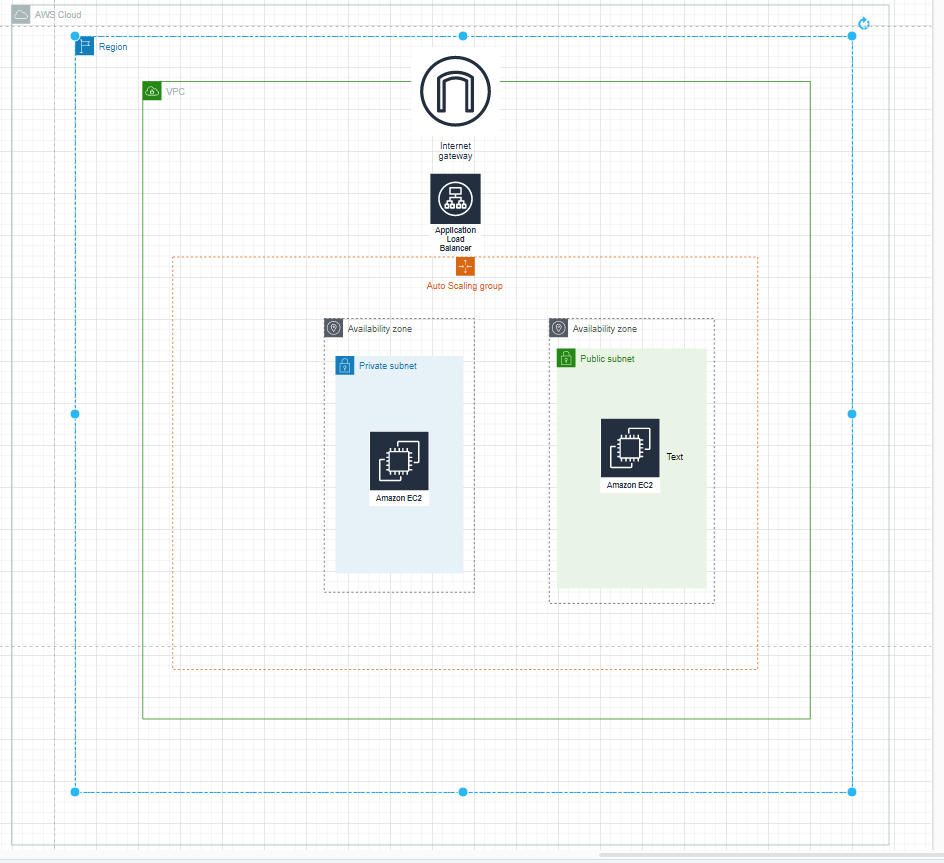
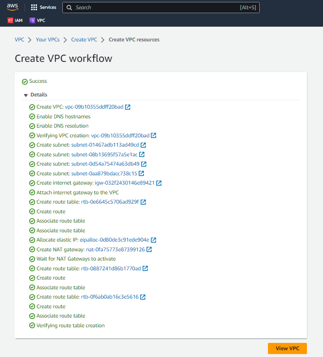
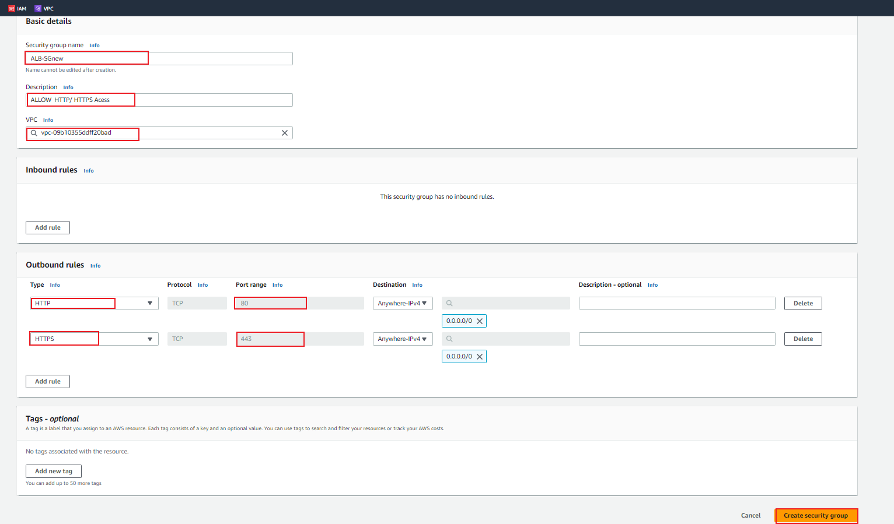
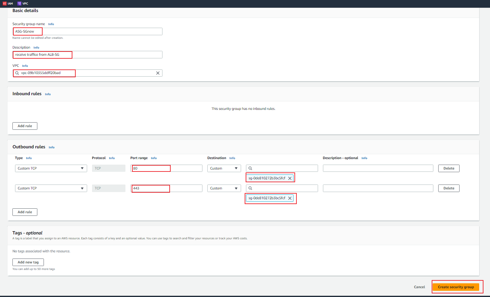
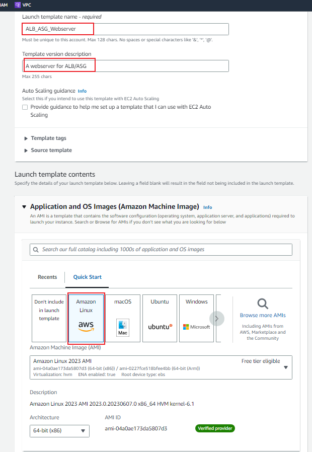
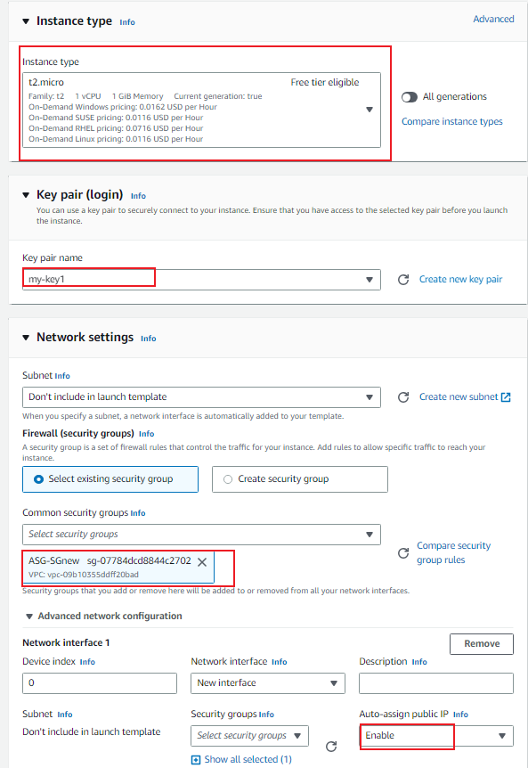
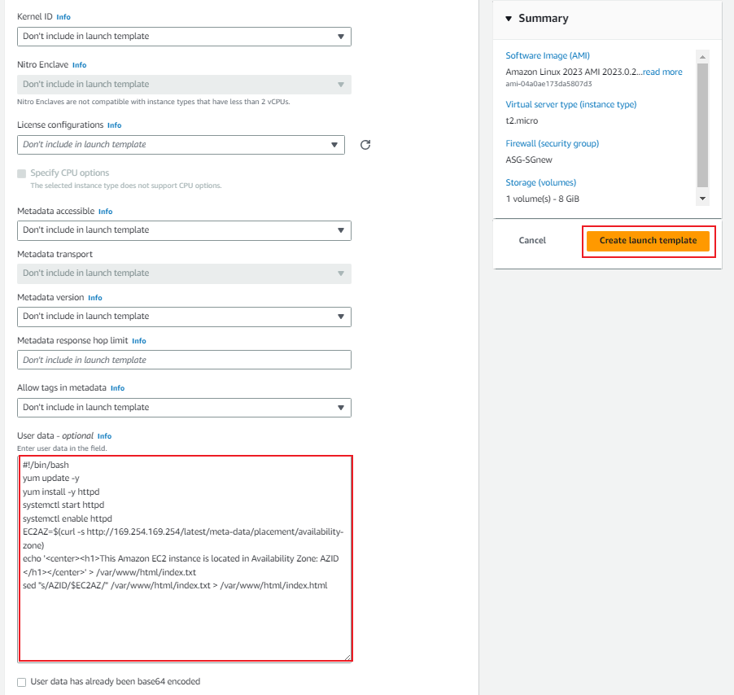
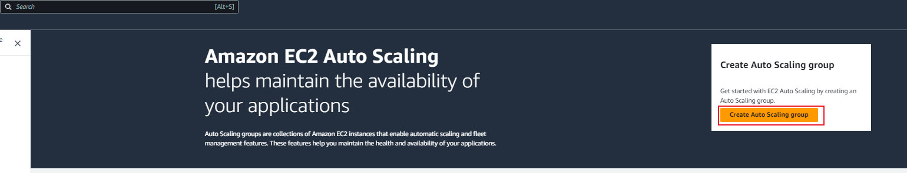

## Task:

Requirements:

- AWS free tier

### Step 1: Create VPC

The first step is to create a new VPC to segment our web app resources. We will create two public subnets and two private subnets both in two different availability zones to ensure high availability.

After logging into the console locate the VPC service from the dashboard. Click “Create VPC”.

We will utilize the newly created VPC experience from AWS to auto-generate the names for our resources as well as create the subnets, route table, internet and nat gateway for us.

- Click on `VPC and More`

Let’s call our "my-project2-vpc" project  and use the 10.10.0.0/16 network for our VPC and break that down into the following public subnets: 10.10.1.0/24, 10.10.2.0/24, and 10.10.3.0/24.

### Step 2: Create Security Groups:

Now that our VPC and network resources have been created we can create a launch template that will be used with our auto-scaling group and application load balancer.

1. Create ALB security group:

- Open the EC2 service in the AWS Management Console.

- Navigate to Security Groups.

- Create a new security group for the ALB.

- Allow incoming traffic on ports 80 and 443 from any source (0.0.0.0/0).

2. Create an ASG Security Group:

- Create another security group for the ASG.

- Configure inbound rules to only allow traffic from the ALB Security Group.

By configuring the inbound rule to only allow traffic from the ALB Security Group, we  are ensuring that only the Application Load Balancer can send traffic to the instances within the Auto Scaling Group (ASG). This provides a secure and controlled access mechanism for incoming requests to our ASG.

### Step 3: Launch Configuration

- Navigate to the EC2 service in the AWS Management Console.

- Click on Launch templates

- Click on Create Launch templates

- Launch template name

- Choose an Amazon Machine Image (AMI) that includes a basic web server (e.g., Amazon Linux AMI).

- Select the t2.micro instance type.

- Configure user data script to install and configure the web server (e.g., using a startup script).

- Associate the ASG Security Group created earlier.

### Step 4: Create an Auto Scaling Group (ASG)

- Within the EC2 service, navigate to Auto Scaling Groups.

- Create a new Auto Scaling Group:

- Select the Launch Configuration created earlier.

- Choose the private subnet created in Step 1.

- Associate the ASG with the ASG Security Group.

- Select “Create a target group” under “Listeners and routing” and leave the default.

- Click  Next.

- Set the desired capacity and maximum size to 2 (to stay within the free tier).

- Enable scaling policies based on desired metrics (e.g., CPU utilization).

- Review and create Auto scaling group

You can go to your EC2 instances section in the console to confirm.

At this pointt, our web apps can receive inbound traffic via the security group we created.
However, our load balance does not have the security group applied.
Let’s go to our load balancer and apply the group.

### Step 5: Create an Application Load Balancer (ALB)

- Within the EC2 service, navigate to Load Balancers.
Create a new Application Load Balancer:
Configure the ALB to listen on ports 80 and 443.
Assign the ALB to the ALB Security Group created earlier.
Specify the public subnet created in Step 1.
Configure health checks and any desired additional settings.