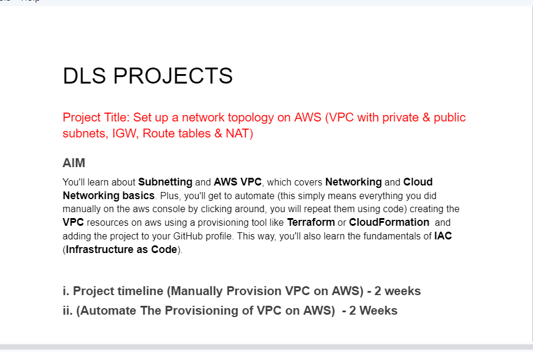
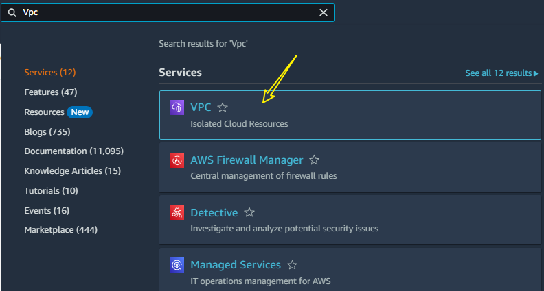
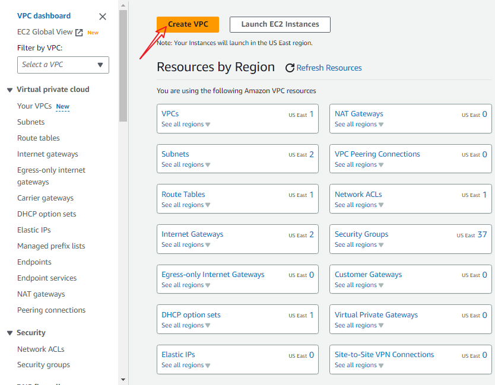
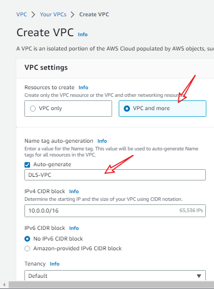
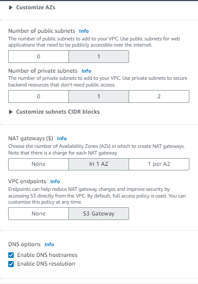
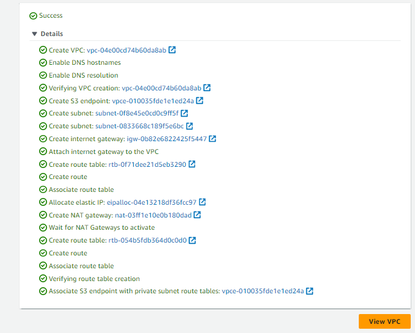

### Introduction:

Amazon Web Services (AWS) offers a seamless process for creating a secure and highly available infrastructure through its automatic configuration capabilities. In this article, we will explore how AWS simplifies the creation of a Virtual Private Cloud (VPC) by automatically configuring subnets and availability zones, providing a reliable and scalable environment for your applications.

Log in to the AWS Management Console and navigate to the VPC service.
Click on "Create VPC" and provide a name, IPv4 CIDR block, and any other desired configuration options.
AWS's automatic configuration kicks in, creating a VPC with default settings and essential components.

AWS automatically configures an internet gateway for the VPC, enabling connectivity to the public internet.
Public subnets are automatically associated with the internet gateway, allowing instances within these subnets to have public IP addresses and be accessible from the internet.
Private subnets, by default, have no direct internet connectivity.
AWS automatically sets up a NAT gateway for private subnets, enabling outbound internet access while providing inbound traffic protection.

- Go to the AWS Management Console and select "VPC and" under "Services".

- Click the "Create VPC" button.

- Kindly note

- Click VPC and more

