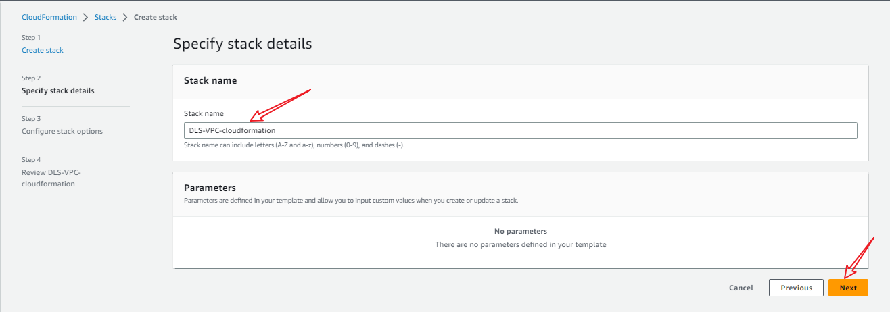

[Useful resource](https://www.google.com/search?q=how+to+use+cloud+formation&rlz=1C1GCEB_enNG1019NG1019&oq=how+to+use+cloud+formation&aqs=chrome..69i57j0i10i512l5j0i22i30j0i10i22i30i625.13977j0j7&sourceid=chrome&ie=UTF-8#fpstate=ive&vld=cid:0e70d36c,vid:YXVCdGyHDSk)

- Continuation of [project 1](https://github.com/Jobijollof/DLS-Devops-Projects/tree/main/project1-Networktop)

- Create a CloudFormation template. 

- The template should define the VPC, public subnet, and private subnet.

- Upload the CloudFormation template.

- Create a CloudFormation stack. 

- The stack will create the VPC, public subnet, and private subnet.

- Cloudformation template in Yaml format.

- Vpc

- Public subnet

- Private Subnet

