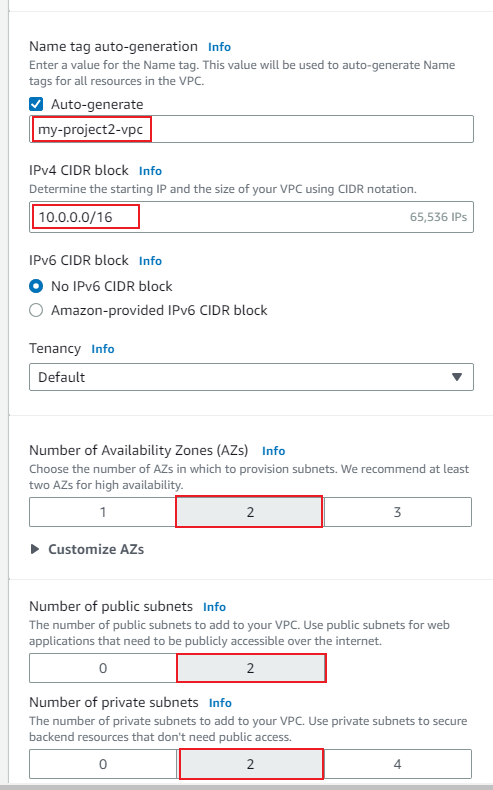

EC2: Amazon Elastic Compute Cloud (EC2) is a service provided by AWS that offers resizable compute capacity in the cloud. It allows users to create and manage virtual computing environments, known as instances.

Instance: An instance refers to a virtual server in the AWS Cloud. It provides users with compute capacity and allows them to run applications on the AWS infrastructure. Instances can be launched, stopped, and terminated as needed.

Load Balancer: A load balancer is a service in AWS that evenly distributes incoming network traffic across multiple resources, such as EC2 instances or containers. It helps optimize resource utilization, improve application availability, and ensure scalability.

Auto Scaling: AWS Auto Scaling is a feature that automatically adjusts the capacity of resources to maintain optimal performance based on predefined conditions and policies. It helps ensure that the right amount of resources are available to handle application load and automatically scales them up or down as needed.

Vertical Scaling:
Vertical scaling, also known as scaling up or scaling vertically, refers to increasing the capacity of a single resource, such as a server or database, by adding more power, memory, or storage to handle increased workload or performance demands. It involves upgrading the existing resource to a higher specification or size. For example, increasing the RAM or CPU capacity of a server to handle more concurrent users.

Horizontal Scaling:
Horizontal scaling, also known as scaling out or scaling horizontally, involves increasing the number of resources, such as servers or instances, to handle increased workload or traffic. Instead of upgrading the existing resources, additional resources are added in parallel to distribute the load. This approach provides improved performance, fault tolerance, and scalability by dividing the workload across multiple resources. For example, adding more instances to an auto-scaling group to handle increased web traffic.

Security Group: A security group is a virtual firewall that controls inbound and outbound traffic for EC2 instances. It acts as a set of firewall rules, allowing or denying traffic based on defined protocols, ports, and IP addresses. Security groups are used to enhance the security of instances and manage network access.

Subnet: A subnet is a range of IP addresses within a VPC (Virtual Private Cloud). It allows partitioning of the VPC's IP address range and enables the creation of distinct network segments. Subnets are associated with availability zones and can be public or private.

VPC: Amazon Virtual Private Cloud (VPC) is a virtual network environment provided by AWS. It allows users to launch AWS resources, such as EC2 instances, within a logically isolated virtual network. VPC provides control over network settings, IP address ranges, subnets, routing tables, and network gateways, offering a high level of customization and security.


Requirements:

- AWS free tier account

### Step 1: Create VPC

The first step is to create a new VPC to segment our web app resources. We will create two public subnets and two private subnets both in two different availability zones to ensure high availability.

After logging into the console locate the VPC service from the dashboard. Click “Create VPC”.


We will utilize the newly created VPC experience from AWS to auto-generate the names for our resources as well as create the subnets, route table, internet and nat gateway for us.

- Click on VPC and More


Let’s call our  vpc "my-project2-vpc"




### Step 2: Create Security Groups:

Now that our VPC and network resources have been created we can create a launch template that will be used with our auto-scaling group and application load balancer.

- Create ALB security group:

Open the EC2 service in the AWS Management Console.

Navigate to Security Groups.

Create a new security group for the ALB.

Allow incoming traffic on ports 80 and 443 from any source (0.0.0.0/0).


- Create an ASG Security Group:

Create another security group for the ASG.

Configure inbound rules to only allow traffic from the ALB Security Group.


### Step 3: Create Launch Template

Navigate to the EC2 service in the AWS Management Console.

Click on Launch templates


```
#!/bin/bash
yum update -y
yum install -y httpd
systemctl start httpd
systemctl enable httpd
EC2AZ=$(curl -s http://169.254.169.254/latest/meta-data/placement/availability-zone) 

echo '<center><h1>This Amazon EC2 instance is located in Availability Zone: AZID </h1></center>' > /var/www/html/index.txt
sed "s/AZID/$EC2AZ/" /var/www/html/index.txt > /var/www/html/index.html

```

### Step 4: Create an Auto Scaling Group (ASG)

Within the EC2 service, navigate to Auto Scaling Group

